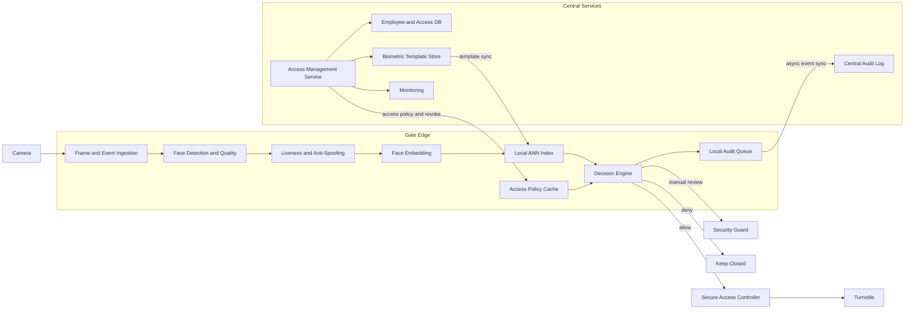

# Architecture

## 1. Общий подход

Для FaceGate используется **гибридная edge-first архитектура**. Критический путь от получения кадра до решения о проходе выполняется на edge-узле непосредственно на проходной. Это позволяет убрать обращение к центральному сервису из hot path, уменьшить latency и продолжать работу при кратковременной потере сети.

Центральный контур является source of truth для сотрудников, biometric templates и access policy, а также отвечает за аудит, мониторинг и распространение обновлений.

Целевой показатель времени принятия решения — **p95 < 1 секунды**.

## 2. Архитектурная схема



## 3. Поток данных

1. Камера формирует кадр и access event и передаёт их на edge.
2. Face Detection определяет наличие лица и проверяет пригодность изображения.
3. Liveness / Anti-Spoofing проверяет, что перед камерой находится живой человек, а не фотография или изображение с экрана.
4. Из лица строится embedding.
5. Embedding сравнивается с локальной базой сотрудников через ANN-индекс.
6. Decision Engine учитывает:
   - качество изображения;
   - результат liveness;
   - лучший match score;
   - отрыв от второго кандидата;
   - access policy;
   - актуальность локального кеша.
7. Система принимает одно из решений:
   - `allow`;
   - `manual_review`;
   - `deny`.
8. Только `allow` передаётся в Secure Access Controller, который управляет турникетом.
9. Каждое решение и его причина записываются в audit log.

## 4. Где выполняется inference

Face detection, quality check, liveness, построение embedding и поиск кандидата выполняются **на edge**.

Такое решение выбрано по трём причинам:

- сетевой round-trip до центрального сервиса не входит в критический путь;
- легче обеспечить p95 < 1 секунды;
- проходная может временно продолжать работу при потере связи с центральной системой.

Центральный сервис не участвует в принятии каждого решения. Он отвечает за master-данные, управление доступами, обновление biometric templates, аудит и мониторинг.

## 5. Хранение данных

В центральном biometric store хранятся зашифрованные embeddings сотрудников. На edge находится необходимая локальная копия активных templates и ANN-индекс для быстрого one-to-many поиска.

Также edge хранит:

- access policy;
- статус доступа сотрудников;
- версию локальных данных;
- время последней синхронизации.

Обычные изображения успешных проходов после обработки **не сохраняются**. Кадр сомнительного события может кратковременно сохраняться для `manual_review` или расследования и затем удаляется согласно retention policy.

Конкретные сроки хранения биометрических данных должны быть дополнительно согласованы с Security и Legal.

## 6. Принятие решения

Decision Engine использует не один match score, а несколько сигналов.

Упрощённая логика:

```text
quality insufficient
→ manual_review

spoof detected
→ deny

liveness uncertain
→ manual_review

high match score + sufficient margin
→ allow

ambiguous identity
→ manual_review

low match score
→ deny
```

Используются два порога идентификации:

- высокий уровень уверенности → `allow`;
- промежуточная зона → `manual_review`;
- низкая уверенность → `deny`.

Дополнительно учитывается разница между первым и вторым кандидатами. Например, match `0.82` не должен автоматически приводить к `allow`, если второй кандидат имеет score `0.79`.

Порог `allow` выбирается консервативно, поскольку false accept является более дорогой ошибкой, чем false reject. Production thresholds должны быть откалиброваны на validation set и данных пилота; значения в PoC являются демонстрационными.

## 7. Liveness и плохое качество кадра

Liveness выполняется до окончательного решения о доступе.

При обнаружении явного spoofing:

```text
decision = deny
turnstile = keep_closed
```

При неуверенном результате:

```text
decision = manual_review
turnstile = keep_closed
```

Если качество изображения недостаточно из-за плохого освещения, маски, ракурса или других факторов, система может предложить повторную попытку. Если получить достаточное качество не удалось, используется карта или ручная проверка.

Сомнение модели никогда не превращается в автоматический `allow`.

## 8. Работа при сбоях

FaceGate использует принцип **fail safe, not fail open**.

| Ситуация | Поведение |
|---|---|
| Central недоступен, edge-кеш актуален | продолжаем локальную работу |
| Сеть недоступна, кеш устарел | автоматический face-based `allow` запрещён |
| ML-модель недоступна | переход на карту / ручную проверку |
| ANN-индекс недоступен | автоматический `allow` запрещён |
| Камера недоступна | используется карточный доступ |
| Неуверенный liveness или match | `manual_review` |
| Spoofing | `deny` |

Карточная система сохраняется в MVP как независимый fallback и позволяет проходной продолжить работу при отказе FaceGate.

## 9. Идемпотентность и защита от двойного открытия

Каждый запрос имеет уникальный `event_id`.

Для одного `event_id` система формирует одно финальное решение и одну логическую команду турникету. Повторная доставка события возвращает уже существующий результат и не создаёт новый `open`.

Схема:

```text
event_id
   ↓
decision_id
   ↓
command_id
```

Secure Access Controller или его adapter также должен дедуплицировать повторные команды по `command_id`.

В offline-режиме access events записываются в локальную очередь и после восстановления сети асинхронно синхронизируются с Central Audit Log.

## 10. Обновление сотрудников и отзыв доступа

Central Service является source of truth для:

- сотрудников;
- biometric templates;
- статусов доступа;
- access policy.

Edge получает версионированные обновления templates и policy.

Обычные изменения могут распространяться асинхронно. Увольнение сотрудника или отзыв доступа являются высокоприоритетным `revoke`-событием и должны максимально быстро применяться на всех edge-узлах.

Для MVP принимается целевой ориентир: **критический revoke должен применяться на edge не позднее чем через 1 минуту при наличии связи**.

После применения revoke сотрудник:

- помечается как неактивный;
- исключается из разрешённого ANN-индекса;
- больше не может получить автоматический `allow`.

Если edge долго не получал обновления и актуальность доступа нельзя гарантировать, система переходит в degraded mode и использует карту или ручную проверку.

## 11. PoC и целевая архитектура

PoC проверяет архитектурную цепочку:

```text
Camera Event
→ CV Pipeline
→ Matching
→ Decision Engine
→ Turnstile Command / Manual Review
→ Audit
```

В PoC упрощены следующие компоненты:

| Компонент | PoC | Target architecture |
|---|---|---|
| Face detection | mock | CV-модель |
| Quality assessment | mock | quality checks / CV model |
| Liveness | mock | anti-spoofing model |
| Embedding | mock | pretrained face recognition model |
| ANN search | заранее подготовленные scores | локальный ANN-индекс |
| Decision Engine | реализован | production decision service |
| Access Controller | mock | защищённый физический контроллер |
| Audit | локальный JSONL | централизованный защищённый audit store |
| Idempotency | локальная | persistent / distributed storage |
